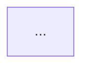
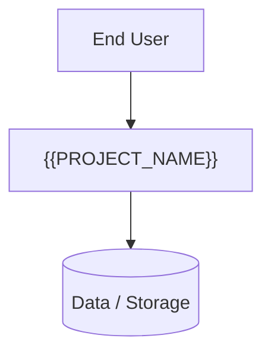

# Overarching System Diagrams

This section provides high-level visual models of the system. Source files for the diagrams are maintained in the `diagrams/` folder as Mermaid (`.mmd`) files.

Mermaid diagrams can be embedded directly using:

When rendered (in GitHub, VS Code, or future Specticus diagram support), they produce visual diagrams.

## Context Diagram

See `diagrams/context-diagram.mmd`

## Flow Diagram

See `diagrams/flow-diagram.mmd`

## Deployment Diagram

See `diagrams/deployment-diagram.mmd`

## Sequence Diagram

See `diagrams/sequence-diagram.mmd`

## Component Diagram

See `diagrams/component-diagram.mmd`

## Class / Data Model Diagram

See `diagrams/class-diagram.mmd`

<!-- Add more diagram sections as you add .mmd files. -->
