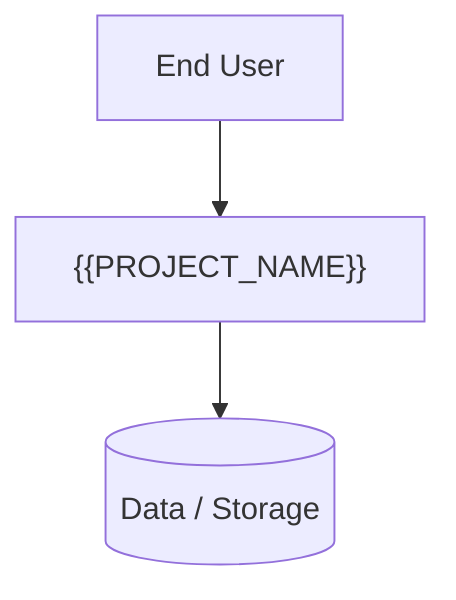

# Overarching System Diagrams

This section provides high-level visual models of the system. Source files for the diagrams are maintained in the `diagrams/` folder as Mermaid (`.mmd`) files.

`scs build` renders those `.mmd` files to `output/svg/` when the Mermaid CLI (`mmdc`) is installed. Backtick references such as `diagrams/context-diagram.mmd` become images in the HTML.

Fenced ` ```mermaid ` blocks in Markdown are left as source (GitHub/VS Code still preview them).

## Context Diagram

See `diagrams/context-diagram.mmd`



## Flow Diagram

See `diagrams/flow-diagram.mmd`

## Deployment Diagram

See `diagrams/deployment-diagram.mmd`

## Sequence Diagram

See `diagrams/sequence-diagram.mmd`

## Component Diagram

See `diagrams/component-diagram.mmd`

## Class / Data Model Diagram

See `diagrams/class-diagram.mmd`

<!-- Add more diagram sections as you add .mmd files. -->
